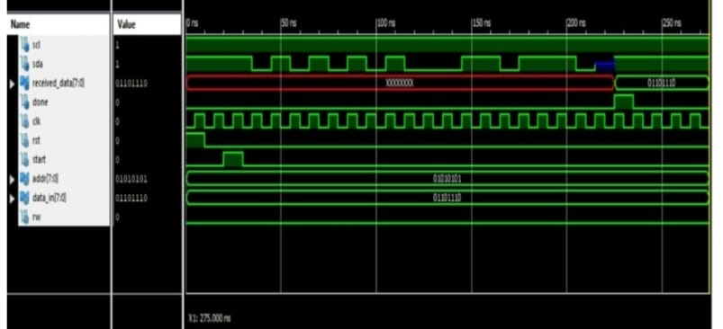
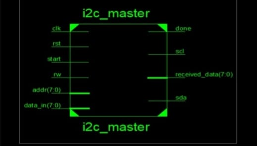
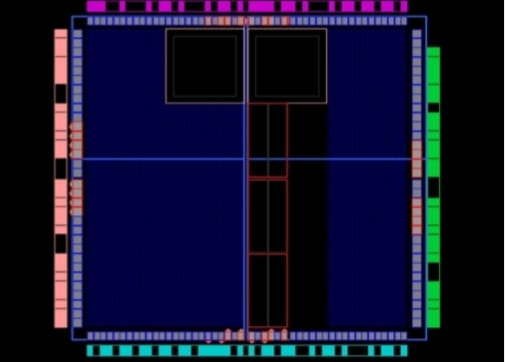
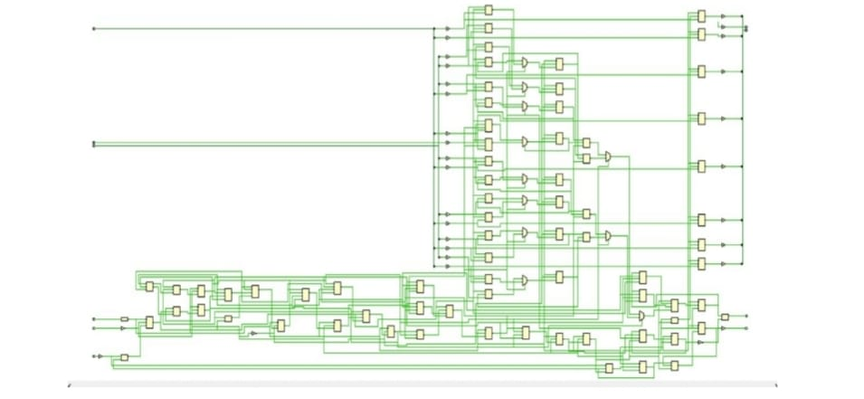

# I2C Master-Slave Verilog

## Digital Design and Implementation of I2C Master-Slave Protocol Using Verilog

A Verilog HDL implementation and simulation of an I2C Master-Slave communication system using a two-wire I2C interface consisting of the Serial Data Line (SDA) and Serial Clock Line (SCL).

The project implements the Master and Slave using a Finite State Machine (FSM) based approach for controlling I2C communication, including START and STOP conditions, slave addressing, read/write operations, data transfer, and acknowledge handling.

---

## 📌 Project Overview

I2C (Inter-Integrated Circuit) is a two-wire serial communication protocol widely used for communication between integrated circuits.

This project focuses on designing and implementing an I2C Master-Slave communication system using Verilog HDL.

The Master controls the communication and generates the SCL clock, while the Slave responds to the Master through the shared SDA communication line.

The design was simulated and verified to observe the communication signals and timing behavior.

---

## 🎯 Objectives

- Design an I2C Master module using Verilog HDL.
- Design an I2C Slave module using Verilog HDL.
- Implement I2C communication using SDA and SCL lines.
- Generate START and STOP conditions.
- Implement slave addressing.
- Support read/write operations.
- Implement acknowledge (ACK) handling.
- Verify the design using a Verilog testbench.
- Observe and analyze the simulation waveform.
- Analyze the synthesized RTL design and FPGA implementation results.

---

## ⚙️ I2C Communication

The I2C interface uses two communication lines:

### SDA — Serial Data Line

SDA is the bidirectional data line used to transfer address and data information between the Master and Slave.

### SCL — Serial Clock Line

SCL is the clock line controlled by the Master to synchronize data transmission and reception.

🧩 Project Modules

1. I2C Master

File:

### 1. I2C Master
[View i2c_master.v](src/i2c_master.v)

The I2C Master controls the communication process.

Main responsibilities include:

Generating the SCL signal.
Initiating communication.
Generating START and STOP conditions.
Sending the slave address.
Performing read/write operations.
Managing data transfer.
Handling acknowledgement.
Indicating completion of the transaction.

The Master controller is implemented using a finite state machine.

2. I2C Slave

File:


### 2. I2C Slave
[View i2c_slave.v](src/i2c_slave.v)


The Slave responds to the Master during an I2C transaction.

The Slave module:

Receives the SCL signal.
Uses the shared SDA line.
Sends data to the Master.
Handles data transfer according to the implemented control sequence.
Provides the required response during communication.
3. Testbench

File:


### 3. Testbench
[View i2c_tb.v](src/tb/i2c_tb.v)

The testbench is used to verify the interaction between the I2C Master and Slave.

The testbench:

Generates the input clock.
Applies reset.
Generates the START request.
Provides the slave address.
Instantiates the I2C Master.
Instantiates the I2C Slave.
Connects the SDA and SCL signals.
Runs the simulation.
Generates waveform data for analysis.


🔄 Design Methodology

The project follows an RTL design and verification flow:

Specification
      ↓
I2C Master Design
      ↓
I2C Slave Design
      ↓
Testbench Development
      ↓
RTL Simulation
      ↓
Waveform Analysis
      ↓
RTL Synthesis
      ↓
FPGA Implementation


🧠 FSM-Based Design

The Master and Slave communication logic is implemented using a finite state machine approach.

The FSM controls different stages of the I2C transaction, such as:

IDLE
START
Address / Data Transfer
READ
ACK handling
STOP

The FSM-based approach provides structured control over the communication sequence.

🧪 Simulation

The design is verified using a Verilog testbench.

The simulation observes important signals including:

clk
reset
start
scl
sda
addr
data_in
data_out
done

The waveform is used to analyze signal transitions and verify the implemented communication sequence.

## Simulation Output

### I2C Simulation Waveform



The waveform shows the simulated I2C communication signals and their timing behavior.

### I2C Master RTL Design



The RTL design view represents the synthesized logical structure of the I2C Master module.

### FPGA Floorplan



The FPGA floorplan shows the placement and routing of the implemented design.

### RTL Schematic



The RTL schematic represents the generated logical structure of the I2C design.

🛠️ Tools and Technologies
Verilog HDL
I2C Protocol
RTL Design
Finite State Machines (FSM)
Digital Logic Design
RTL Simulation
FPGA Design
Xilinx Vivado
XSIM Simulation


## Repository Structure

```text
i2c-master-slave-verilog/
│
├── README.md
│
├── src/
│   ├── i2c_master.v
│   ├── i2c_slave.v
│   │
│   └── tb/
│       └── i2c_tb.v
│
└── images/
    ├── output_waveform.jpeg
    ├── i2c_master_rtl.jpeg
    ├── fpga_floorplan.jpeg
    └── rtl_schematic.jpeg

